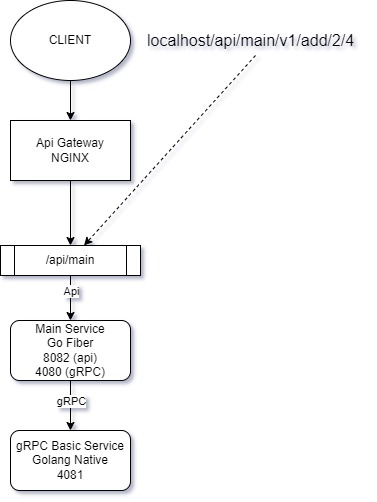

# GO Fiber + GROM + gRPC (for microservice)

**baca terlebih dahulu sampai bawah/selesai sebelum clone repo ini...**

---

## Folder Structure
```
go-fiber-gorm-grpc-for-microservice
│
└─── api-gateway
│       file project...
│
└─── main-service (this repo)
│       file project...
│
└─── grpc-basic-service
        file project...
```

---

## How to Use
1. install Docker Desktop or Docker (whatever)
2. create container :
```bash
docker-compose up -d
```
3. create all container microservices testing (link bellow)

---

## Clone All Microservices Testing
- [Api Gateway](https://github.com/jefripunza/nginx-load-balance-microservice.git)
- [gRPC Basic Service](https://github.com/jefripunza/example-grpc-basic-service.git)



---

## URL Testing (result)
- React JS [http://localhost](http://localhost)
  

Note :
- clone semua ini didalam 1 folder (seperti di **Folder Structure**)
- perhatikan port default pada docker network (disini di set 172.17.0.1) (lihat di Dockerfile)
