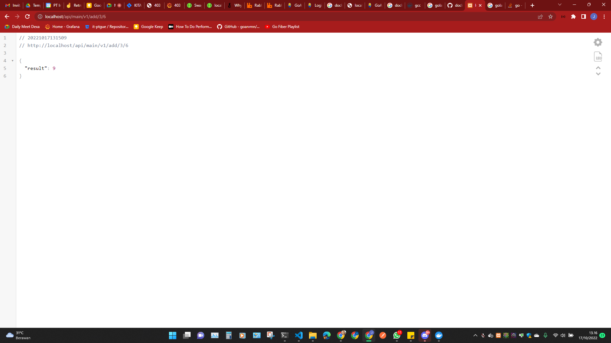
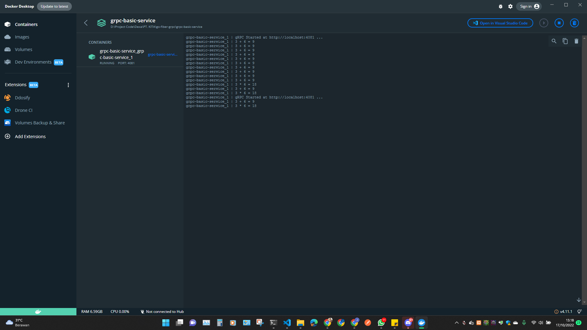

# GO Fiber + GROM + gRPC (for microservice)

**baca terlebih dahulu sampai bawah/selesai sebelum clone repo ini...**

---

## Structure Directory of System

| Name         | Path        | Description                                                                                                     | Generate  |
|--------------|-------------|-----------------------------------------------------------------------------------------------------------------|:---------:|
| docs         | /           | hasil generate dari **swagger** (swag init)                                                                     |  ✅ auto   |
| proto        | /           | hasil generate dari protoc, menyimpan file **protobuf** dan juga generate nya                                   |  ✅ auto   |
| apps         | /src        | semua **Ready App** dari **Server, Database, gRPC server, Redis, RabbitMQ, WebSocket**                          |     ❌     |
| configs      | /src        | cara/method pengambilan value dari **.env**                                                                     |     ❌     |
| consumer     | /src        | listening RabbitMQ Queue                                                                                        | ✅ organic |
| controllers  | /src        | handling request (api) value nya apa saja/type                                                                  | ✅ organic |
| dto          | /src        | **(data transfer object)** management format request & response                                                 | ✅ organic |
| handlers     | /src        | membuat method handler seperti **try catch** dan lain2...                                                       |     ❌     |
| helpers      | /src        | menampung semua logic kebutuhan yang bisa di **reusable**                                                       |     ❌     |
| messages     | /src        | **format penulisan** apapun (semua) sehingga jika ada perubahan (text) tinggal rubah 1x saja                    | ✅ organic |
| middlewares  | /src        | **jembatan logic** sebelum masuk ke **logic utama**, biasanya seperti **token validation** atau yang lainnya... | ✅ organic |
| entities     | /src/models | schema tables digunakan untuk **validasi table database** dan **migration table**                               | ✅ organic |
| repositories | /src/models | logic khusus untuk pengolahan database (insert, read, update, delete)                                           | ✅ organic |
| remotes      | /src        | function pengambilan data dari gRPC service lain (communications)                                               | ✅ organic |
| routers      | /src        | tempat routing endpoint url (api) dan juga pemasangan middleware                                                | ✅ organic |
| services     | /src        | tempat **logic utama** dari service ini (logic utama hanya boleh disini)                                        | ✅ organic |
| utils        | /src        | method penting yang sangat digunakan dan bisa saja reusable                                                     |     ❌     |
| tests        | /           | tempat **unit test** logic dari services                                                                        | ✅ organic |

---

## Files Information

| Name                            | Extension    | Path        | Description                                                        |
|---------------------------------|--------------|-------------|--------------------------------------------------------------------|
| swagger                         | .json, .yaml | /docs       | untuk dokumentasi API                                              |
| proto                           | .proto       | /proto      | schema protobuf untuk komunikasi gRPC                              |
| migration table (migrations.go) | .go          | /src/models | otomatis sync table yang teregistrasi                              |
| environment (select)            | .env         | /           | untuk memilih sekarang ini environment apa                         |
| environment (value)             | .env.*       | /           | isi variable yang ingin di expose                                  |
| rabbitmq value                  | .rabbitmq.*  | /           | list exchange & queue value                                        |
| database (sqlite)               | .db          | /           | file database lokal (file)                                         |
| package.json script (nodejs)    | .json        | /           | untuk menyimpan segala format execute biar mempermudah development |
| OVVBT CLI App (./ovvbt)         | -            | /           | aplikasi cli untuk membantu dalam mempercepat development          |

---

## Structure Directory of Microservice

```
go-fiber-gorm-grpc-for-microservice
│
└─── api-gateway
│       file project...
│
└─── main-service (this repo)
│       file project...
│
└─── grpc-basic-service
        file project...
```

---

## How to Use

1. install Docker Desktop or Docker (whatever)
2. create container :
```bash
docker-compose up -d
```
3. create all container microservices testing (link bellow)

---

## Clone All Microservices Testing

- [Api Gateway](https://github.com/jefripunza/nginx-load-balance-microservice.git)
- [gRPC Basic Service](https://github.com/jefripunza/example-grpc-basic-service.git)


---

## URL Testing (result)

- Add [http://localhost/api/main/v1/add/3/6](http://localhost/api/main/v1/add/3/6)
  
- Multiply [http://localhost/api/main/v1/multiply/3/6](http://localhost/api/main/v1/multiply/3/6)
  
- Result (gRPC Basic Service) in Docker
  

Note :
- clone semua ini didalam 1 folder (seperti di **Folder Structure**)
- perhatikan port default pada docker network (disini di set 172.17.0.1) (lihat di Dockerfile)
