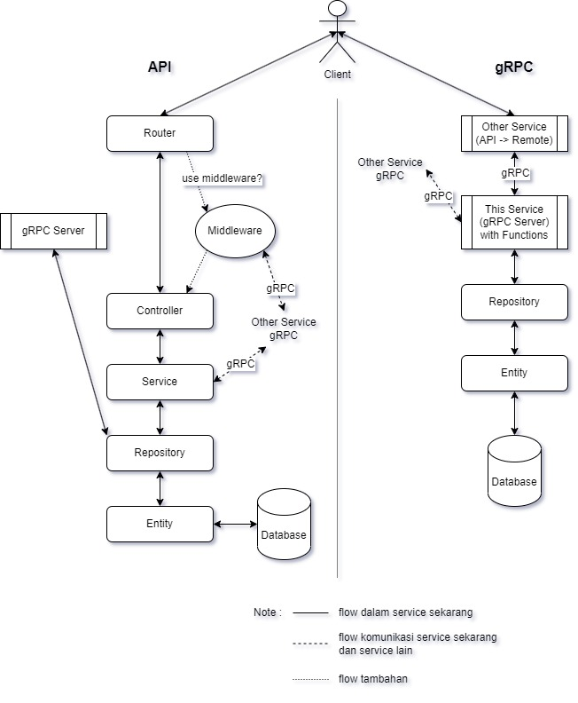

# GO Fiber + GROM + gRPC (for microservice)

**baca terlebih dahulu sampai bawah/selesai sebelum clone repo ini...**

---

## Structure Directory of System

| Name         | Path                         | Description                                                                                                     | Generate  |
|--------------|------------------------------|-----------------------------------------------------------------------------------------------------------------|:---------:|
| docs         | /docs                        | hasil generate dari **swagger** (swag init)                                                                     |  ✅ auto   |
| proto        | /proto                       | hasil generate dari protoc, menyimpan file **protobuf** dan juga generate nya                                   |  ✅ auto   |
| apps         | /src/apps                    | semua **Ready App** dari **Server, Database, gRPC server, Redis, RabbitMQ, WebSocket**                          |     ❌     |
| configs      | /src/configs                 | cara/method pengambilan value dari **.env**                                                                     |     ❌     |
| consumer     | /src/consumer/queues         | listening RabbitMQ Queue                                                                                        | ✅ organic |
| controllers  | /src/controllers             | handling request (api) value nya apa saja/type                                                                  | ✅ organic |
| dto          | /src/request , /src/response | **(data transfer object)** management format request & response                                                 | ✅ organic |
| helpers      | /src/helpers                 | menampung semua logic kebutuhan yang bisa di **reusable**                                                       |     ❌     |
| messages     | /src/messages                | **format penulisan** apapun (semua) sehingga jika ada perubahan (text) tinggal rubah 1x saja                    |     ❌     |
| middlewares  | /src/middlewares             | **jembatan logic** sebelum masuk ke **logic utama**, biasanya seperti **token validation** atau yang lainnya... | ✅ organic |
| entities     | /src/models/entities         | schema tables digunakan untuk **validasi table database** dan **migration table**                               | ✅ organic |
| repositories | /src/models/repositories     | logic khusus untuk pengolahan database (insert, read, update, delete)                                           | ✅ organic |
| remotes      | /src/remotes                 | function pengambilan data dari gRPC service lain (communications)                                               | ✅ organic |
| routers      | /src/routers/endpoints       | tempat routing endpoint url (api) dan juga pemasangan middleware                                                | ✅ organic |
| scheduler    | /src/scheduler/tasks         | tempat scheduler register dan tasks yang dipakai                                                                | ✅ organic |
| services     | /src/services                | tempat **logic utama** dari service ini (logic utama hanya boleh disini)                                        | ✅ organic |
| utils        | /src/utils/*                 | method penting yang sangat digunakan dan bisa saja reusable                                                     |     ❌     |
| tests        | /tests                       | tempat **unit test** logic dari services                                                                        | ✅ organic |

---

## Routing Schemas





---

## Files Information

| Name                            | Extension    | Path        | Description                                                        |
|---------------------------------|--------------|-------------|--------------------------------------------------------------------|
| swagger                         | .json, .yaml | /docs       | untuk dokumentasi API                                              |
| proto                           | .proto       | /proto      | schema protobuf untuk komunikasi gRPC                              |
| migration table (migrations.go) | .go          | /src/models | otomatis sync table yang teregistrasi                              |
| add to register (register.go)   | .go          | /src/**/    | list semua function yang di registrasi                             |
| environment (select)            | .env         | /           | untuk memilih sekarang ini environment apa                         |
| environment (value)             | .env.*       | /           | isi variable yang ingin di expose                                  |
| rabbitmq value                  | .rabbitmq.*  | /           | list exchange & queue value                                        |
| database (sqlite)               | .db          | /           | file database lokal (file)                                         |
| package.json script (nodejs)    | .json        | /           | untuk menyimpan segala format execute biar mempermudah development |
| OVVBT CLI App (./ovvbt)         | -            | /           | aplikasi cli untuk membantu dalam mempercepat development          |

---

## KITAPP CLI App


Execute ?
```bash
./kita
```

---

## Structure Directory of Microservice

clone dalam 1 folder...

```
go-fiber-gorm-grpc-for-microservice
│
└─── api-gateway
│       file project...
│
└─── main-service (this repo)
│       file project...
│
└─── grpc-basic-service
        file project...
```

---

## How to Use

1. clone project ini...
```bash
// api-gateway
git clone https://github.com/jefripunza/nginx-load-balance-microservice.git api-gateway

// main-service
git clone https://github.com/jefripunza/go-fiber-gorm-grpc-for-microservice.git main-service

// grpc-basic-service
git clone https://github.com/jefripunza/example-grpc-basic-service grpc-basic-service
```
2. install development require...
```bash
go mod tidy
```
3. install [Docker Desktop or Docker](https://www.docker.com/) (whatever)
4. open/running Docker
5. install require...
```bash
// RabbitMQ (docker)
./ovvbt install rabbitmq
```
6. pastikan RabbitMQ (docker) sudah berjalan
7. setup RabbitMQ...
```
- akses -> http://localhost:15672/
- credential -> user:guest pass:guest
- create exchange "example-testing-exchange"
- create queue "example-testing-queue"
- binding queue to exchange
```
8. create container/image di semua folder :
```bash
docker-compose up -d
```

---

## Microservice Schema


---

## URL Testing (result)

- Add [http://localhost/api/main/v1/add/3/6](http://localhost/api/main/v1/add/3/6)
  
- Multiply [http://localhost/api/main/v1/multiply/3/6](http://localhost/api/main/v1/multiply/3/6)
  
- Result (gRPC Basic Service) in Docker
  

Note :
- clone semua ini didalam 1 folder (seperti di **Folder Structure**)
- pastikan sudah setup exchange dan queue di RabbitMQ
- perhatikan port default pada docker network (disini di set 172.17.0.1) (lihat di Dockerfile)
